# Retail E-Com Voice Live Agent with Avatar

This solution demonstrates the use case where:

1) A Customer:
- browses through the Catalog, Orders products
- Provides a destination address and has a Shipment Order created for the purchase
- Asks queries around Contoso Retail's policies and product support

2) The Call conversation between the Customer and Voice Agent gets captured, and analysis of the quality of the conversation is done using an Agent, on the following aspects:
- customer sentiment 
- rating the call, justifying the rating
- reasons for the call, 
- the Product in question, etc.

The Customer experience is powered using a `Live Avatar` and `Speech-to-Speech` experience through `Azure Voice Live API`. Through a single API interface that it provides, the entire experience can be implemented.
The Application is a `Python FAST API` backend and a `TypeScript` browser client. The backend keeps the Azure Voice Live `realtime session` (including all tool calls) while the browser attaches to the avatar stream through `WebRTC`.

## Demo of the Application in Action

See this retail voice agent application in action! Click the image below to watch a live demonstration of the avatar-powered conversation experience:

[](https://youtu.be/NWf2lzJx54U "Retail Voice Agent with Avatar - Live Demo")

*🎥 Click the image above to watch the demo on YouTube*

## Comprehensive Solution Architecture

This application implements a **hybrid architecture** using both **WebSocket proxying** and **direct WebRTC connections** for optimal performance and centralized control.

Here is the high level view of the architecture used in the solution. 

### Key Components

- **Frontend (`frontend/`)** – Vite + React client that captures user audio, streams PCM chunks to the backend over WebSocket, renders assistant audio locally, and establishes direct WebRTC connections for avatar video streaming.
- **Backend (`backend/`)** – FastAPI service that acts as a WebSocket proxy between the frontend and Azure Voice Live API, manages sessions, handles function calls, and facilitates WebRTC SDP negotiation for avatar connections.
- **Azure Voice Live API** – Microsoft's realtime AI service that acts as a gateway to GPT-4 Realtime Model, processes audio, generates responses, and provides avatar video streams via WebRTC.

```mermaid
graph TB
    %% User Device Layer
    subgraph UserDevice["👤 User's Computer/Phone"]
        Browser["🌐 Web Browser<br/>- Frontend React App<br/>- Web Audio API<br/>- WebRTC"]
        Microphone["🎤 Microphone"]
        Speakers["🔊 Speakers"]
        Camera["📹 Display"]
    end

    %% Internet
    Internet["🌐 Internet<br/>HTTPS/WSS/WebRTC"]

    %% Azure Container Apps Environment
    subgraph ACA["☁️ Azure Container Apps Environment"]
        subgraph Container["🐳 Single Container Application"]
            subgraph Frontend["📱 Frontend Server"]
                ViteServer["⚡ Vite Server<br/>Node.js Runtime<br/>- TypeScript/JavaScript execution<br/>- Hot module replacement<br/>- Static asset serving<br/>- Development proxy"]
                ReactApp["⚛️ React Application<br/>- TypeScript components<br/>- Audio processing<br/>- WebSocket client<br/>- WebRTC peer connection"]
            end
            
            subgraph Backend["🐍 Backend Server"]
                FastAPI["🚀 FastAPI Application<br/>ASGI Server (uvicorn)<br/>- Async request handling<br/>- WebSocket support<br/>- Non-blocking I/O<br/>- Python async/await"]
                SessionMgr["📋 Session Manager<br/>- WebSocket connections<br/>- Session lifecycle<br/>- Audio proxy"]
                Tools["🛠️ Function Tools<br/>- Product search<br/>- Order processing<br/>- QnA retrieval"]
            end
        end
    end

    %% Azure Voice Live API (Primary Service)
    subgraph VoiceLive["🎭 Azure Voice Live API"]
        Avatar["👨‍💼 Avatar Service<br/>- Video generation<br/>- Voice synthesis<br/>- WebRTC streaming<br/>- Character: lisa/james/michelle"]
        TTS["🗣️ Text-to-Speech<br/>- Neural voices<br/>- Audio streaming<br/>- Real-time synthesis"]
        VoiceLiveGateway["🚪 Voice Live Gateway<br/>- WebSocket proxy<br/>- Session management<br/>- Model routing"]
    end

    %% Azure OpenAI Service (Behind Voice Live)
    subgraph OpenAI["🧠 Azure OpenAI Service"]
        GPTRealtime["🤖 GPT-4 Realtime Model<br/>- Real-time audio processing<br/>- Function calling<br/>- Conversation management<br/>- Response generation"]
    end

    %% Business Services Layer
    subgraph BusinessServices["🏢 Business Services"]
        subgraph ContosoAPI["🛍️ Contoso E-Commerce API<br/>(Azure Container Apps)"]
            ProductAPI["📦 Product Search API<br/>- Catalog browsing<br/>- Inventory lookup<br/>- Price information"]
            OrderAPI["🛒 Order Processing API<br/>- Cart management<br/>- Order creation<br/>- Payment processing"]
        end
        
        subgraph LogicApps["⚡ Azure Logic Apps"]
            ShipmentFlow["📦 Shipment Logic App<br/>🤖 Agent Workflow:<br/>- Order validation<br/>- Shipping label creation<br/>- Carrier integration<br/>- Status tracking"]
            ConversationFlow["💬 Conversation Analysis App<br/>🤖 Agent Workflow:<br/>- Conversation parsing<br/>- Sentiment analysis<br/>- Quality scoring<br/>- Performance metrics"]
        end
        
        AISearch["🔍 Azure AI Search<br/>- Vector search<br/>- Semantic search<br/>- QnA knowledge base<br/>- Customer manuals"]
    end

    %% Data Storage Layer
    subgraph DataLayer["💾 Data Storage"]
        CosmosDB["🌟 Azure Cosmos DB<br/>- Conversation history<br/>- User interactions<br/>- Analytics data<br/>- JSON documents"]
        SQLDatabase["🗄️ Azure SQL Database<br/>- Order records<br/>- Shipment tracking<br/>- Relational data<br/>- ACID transactions"]
    end

    %% Connection Flows

    %% User interactions
    Browser --> Microphone
    Browser --> Speakers
    Browser --> Camera

    %% Internet connectivity
    Browser <-->|"HTTPS/WSS"| Internet
    Internet <-->|"HTTPS/WSS"| Container

    %% Container internal communication
    ReactApp <-->|"Local API calls"| FastAPI
    ViteServer -.->|"Development proxy"| FastAPI

    %% WebSocket connections - Corrected Flow
    ReactApp <-->|"📡 WebSocket<br/>Audio chunks (base64)<br/>Transcripts<br/>Commands"| SessionMgr
    SessionMgr <-->|"📡 WebSocket<br/>Audio chunks<br/>Function calls<br/>Responses"| VoiceLiveGateway
    VoiceLiveGateway <-->|"🔗 Internal Connection<br/>Model requests<br/>AI processing"| GPTRealtime

    %% Direct WebRTC connection (bypassing backend)
    Browser <-->|"🎥 WebRTC Video Stream<br/>Direct connection<br/>Low latency<br/>H.264 encoding"| Avatar
    
    %% SDP negotiation through backend
    ReactApp -->|"HTTP POST<br/>SDP Offer"| FastAPI
    FastAPI -->|"SDP Answer"| ReactApp
    FastAPI <-->|"SDP Exchange<br/>base64 encoded"| Avatar

    %% Function call integrations
    Tools <-->|"🔍 REST API<br/>Search queries<br/>Knowledge retrieval"| AISearch
    Tools <-->|"🛍️ REST API<br/>Product searches<br/>Order creation"| ContosoAPI
    Tools <-->|"⚡ HTTP Webhook<br/>Shipment requests<br/>Conversation data"| LogicApps

    %% Logic Apps data flow
    ShipmentFlow -->|"📊 Order records<br/>Shipment tracking"| SQLDatabase
    ConversationFlow -->|"💬 Conversation analysis<br/>Quality metrics<br/>JSON documents"| CosmosDB

    %% Styling
    classDef userClass fill:#e1f5fe,stroke:#01579b,stroke-width:2px
    classDef azureClass fill:#fff3e0,stroke:#e65100,stroke-width:2px
    classDef containerClass fill:#f3e5f5,stroke:#4a148c,stroke-width:2px
    classDef aiClass fill:#e8f5e8,stroke:#1b5e20,stroke-width:2px
    classDef businessClass fill:#fff8e1,stroke:#f57f17,stroke-width:2px
    classDef dataClass fill:#fce4ec,stroke:#880e4f,stroke-width:2px

    class UserDevice,Browser,Microphone,Speakers,Camera userClass
    class ACA,Container,OpenAI,VoiceLive azureClass
    class Frontend,Backend,ViteServer,ReactApp,FastAPI,SessionMgr,Tools containerClass
    class GPTRealtime,Avatar,TTS,AISearch aiClass
    class BusinessServices,ContosoAPI,LogicApps,ProductAPI,OrderAPI,ShipmentFlow,ConversationFlow businessClass
    class DataLayer,CosmosDB,SQLDatabase dataClass
```





### Architecture Components Explained

#### 🐳 Container Application Architecture
- **Vite Server**: Node.js-based development server that serves the React application. In development, it provides hot module replacement and proxies API calls to `FastAPI`. In production, the React app is built into static files served by FastAPI.
- **FastAPI with ASGI**: Python web framework running on `uvicorn ASGI server`. ASGI (Asynchronous Server Gateway Interface) enables handling multiple concurrent connections efficiently, crucial for WebSocket connections and real-time audio processing.

#### 🤖 AI & Voice Services Integration
- **Azure Voice Live API**: Primary service that manages the connection to GPT-4 Realtime Model, provides avatar video generation, neural text-to-speech, and WebSocket gateway functionality
- **GPT-4 Realtime Model**: Accessed through Azure Voice Live API for real-time audio processing, function calling, and intelligent conversation management

#### 🔄 Communication Flows
1. **Audio Flow**: Browser → WebSocket → FastAPI → WebSocket → Azure Voice Live API → GPT-4 Realtime Model
2. **Video Flow**: Browser ↔ WebRTC Direct Connection ↔ Azure Voice Live API (bypasses backend for performance)
3. **Function Calls**: GPT-4 Realtime (via Voice Live) → FastAPI Tools → Business APIs → Response → GPT-4 Realtime (via Voice Live)

#### 🤖 Business process automation Workflows / RAG
- **Shipment Logic App Agent**: Analyzes orders, validates data, creates shipping labels, and updates tracking information
- **Conversation Analysis Agent**: Azure Logic App Reviews complete conversations, performs sentiment analysis, generates quality scores with justification, and stores insights for continuous improvement
- **Knowledge Retrieval**: Azure AI Search is used to reason over manuals and help respond to Customer queries on policies, products


### KEY COMMUNICATION FLOWS:

The application uses **three distinct communication flows**:


🎵 AUDIO FLOW:
Browser → WebSocket → FastAPI → WebSocket → Azure Voice Live → GPT Realtime

1. **Microphone Capture**: Frontend captures audio using Web Audio API
2. **Audio Processing**: Downsamples audio to 24kHz, converts to base64
3. **WebSocket Transmission**: Sends audio chunks to FastAPI backend via WebSocket
4. **Proxy Relay**: Backend forwards audio to Azure Voice Live API via separate WebSocket
5. **Response Processing**: Azure Voice Live API processes responses from GPT-4 Realtime Model and sends back audio deltas, transcripts, and commands
6. **Response Relay**: Backend forwards responses back to frontend via WebSocket
7. **Audio Playback**: Frontend schedules audio playback using Web Audio API

🎥 VIDEO FLOW:
Browser ↔ WebRTC Direct Connection ↔ Azure Voice Live (bypasses backend for performance)

`Avatar Video Flow`
1. **WebRTC Initialization**: Frontend creates RTCPeerConnection when "Start Avatar" is clicked
2. **SDP Offer Creation**: Frontend generates WebRTC offer with audio/video transceivers
3. **SDP Negotiation**: FastAPI backend acts as SDP broker:
   - Receives SDP offer via HTTP POST
   - Encodes offer as base64 JSON and sends to Azure Voice Live
   - Receives SDP answer from Azure Voice Live
   - Decodes and returns SDP answer to frontend
4. **Direct Connection**: Frontend establishes direct WebRTC connection to Azure Voice Live
5. **Video Streaming**: Avatar video streams directly from Azure to browser (bypassing backend)
6. **ICE Server Configuration**: Backend provides TURN/STUN servers via WebSocket for NAT traversal

🔧 FUNCTION CALLS:
GPT Realtime → FastAPI Tools → Business APIs → Response → GPT Realtime

1. **AI Decision**: GPT-4 Realtime Model (accessed via Azure Voice Live API) determines when to call functions based on conversation
2. **Function Execution**: Backend receives function calls from Azure Voice Live API and executes them:
   - Azure AI Search for knowledge queries
   - E-commerce APIs for product searches and orders
   - Logic Apps for shipments and call logging
3. **Result Return**: Backend sends function results back to Azure Voice Live API
4. **Response Generation**: GPT-4 Realtime Model (via Azure Voice Live API) incorporates results into conversational response

Function call outputs are posted back to the realtime session so the model can continue the conversation seamlessly.


### Why This Hybrid Architecture?

This design provides the best of both worlds:

#### WebSocket Proxy Benefits:
- **Centralized Authentication**: Backend manages Azure credentials securely
- **Request Logging**: All interactions can be logged and monitored
- **Function Call Handling**: Business logic stays server-side
- **Connection Management**: Backend handles connection resilience and retries
- **CORS Avoidance**: No cross-origin issues for API calls

#### Direct WebRTC Benefits:
- **Low Latency**: Video streams directly without proxy overhead
- **High Quality**: No compression or re-encoding of video stream
- **Browser Optimization**: Leverages browser's native WebRTC optimizations
- **Bandwidth Efficiency**: Avoids double bandwidth usage through proxy

#### Security Model:
- **Frontend**: No direct Azure credentials, communicates only with trusted backend
- **Backend**: Holds all Azure credentials, validates all requests
- **WebRTC**: Secured via ICE/DTLS, SDP negotiation controlled by backend


### Browser Workflow

1. The app requests a new session from the backend and opens a WebSocket bridge.
2. Clicking **Start Microphone** captures audio, downsamples to 24 kHz float frames, and pushes base64 chunks to the backend.
3. Assistant audio deltas returned by the backend are scheduled in a browser `AudioContext` for playback.
4. Clicking **Start Avatar** creates a `RTCPeerConnection`, sends the SDP offer to `/avatar-offer`, and sets the returned answer. The avatar video and audio render through the `<video>` element.


## Business Services Integration

The architecture diagram shows several business services that work together to provide a complete retail e-commerce experience. **Note: The code for these business service components is not included in this repository**, but the details and implementation guidance are provided below. Function calling is used to execute these Business Services.

### 🛍️ Contoso E-Commerce API (Azure Container Apps)

The Contoso retail API provides the core e-commerce functionality for product search and order processing.

#### Product Search API

**Available at**: [`./images/swagger.json`](./images/swagger.json)

- **Endpoint**: `/api/products/search`
- **Method**: `GET`
- **Parameters**: 
  - `category` (required): Product category filter
  - `price` (required): Maximum price filter
- **Functionality**: 
  - Search products by category and maximum price
  - Returns filtered product catalog with detailed information
  - Includes product ID, name, description, price, category, and image URL
- **Integration**: Called by FastAPI tools when GPT-4 needs to search products
- **Sample Response**:
```json
[
  {
    "id": 1,
    "ProductName": "Premium Cotton Shirt",
    "Category": "Clothing",
    "Price": 59.99,
    "ProductDescription": "High-quality cotton shirt perfect for casual and business wear",
    "imageurl": "https://contoso.com/images/shirt_001.jpg"
  },
  {
    "id": 2,
    "ProductName": "Denim Jeans",
    "Category": "Clothing", 
    "Price": 89.99,
    "ProductDescription": "Classic fit denim jeans made from premium fabric",
    "imageurl": "https://contoso.com/images/jeans_002.jpg"
  }
]
```

**Endpoint**: `/api/products/category/{category}`
- **Method**: `GET`
- **Path Parameter**: `category` - Product category to filter by
- **Functionality**: Returns all products in a specific category

#### Order Processing API
- **Endpoint**: `/api/orders/`
- **Method**: `GET`
- **Parameters**:
  - `id` (required): Product ID to order
  - `quantity` (required): Quantity to order
- **Functionality**:
  - Creates an order for a specific product and quantity
  - Calculates total order amount automatically
  - Returns complete order information with tracking details
- **Integration**: Triggered when customers complete purchases through the voice agent
- **Sample Response**:
```json
{
  "OrderId": "ORD_789123",
  "ProductId": 1,
  "Name": "Premium Cotton Shirt",
  "Quantity": 2,
  "Price": 59.99,
  "Total": 119.98
}
```

#### ⚡ Azure Logic Apps - Intelligent Agent Workflows

The Logic Apps implement intelligent agent workflows that provide autonomous processing and analysis capabilities.

##### 📦 Shipment Logic App Agent

**Purpose**: Autonomous creation of a Shipment Order based on the Retail Ordeer ID and Destination Address.

It takes the Order number from the previous step along with the destination address of the Customer and creates a Shipment Order in Azure SQL Database.


##### 💬 Conversation Analysis Logic App Agent

**Purpose**: Intelligent conversation analysis with objective quality assessment and insights generation.

This Logic App is an Agent in itself and uses Azure OpenAI gpt-4o model to evaluate the call logs and provide an assessment of the call, and stores that in Azure CosmosDB


Here is a Call log Analysis document stored in Azure CosmosDB

```json
{
    "id": "c6cd9c84b5b647399ddaba036de3f7db",
    "call_reason": "Cold pack broken, water inside bag",
    "customer_satisfaction": "not satisfied",
    "customer_sentiment": "negative",
    "rating": 2,
    "rating_justification": "The agent was very rude and unable to address my concerns",
    "_rid": "0o0QAKScZqs-AAAAAAAAAA==",
    "_self": "dbs/0o0QAA==/colls/0o0QAKScZqs=/docs/0o0QAKScZqs-AAAAAAAAAA==/",
    "_etag": "\"0100fa68-0000-4700-0000-6894bd620000\"",
    "_attachments": "attachments/",
    "_ts": 1754578274
}

```

#### 🔍 Azure AI Search Integration

**Purpose**: Provides intelligent search capabilities for customer support and product knowledge.


## Prerequisites

- Python 3.10+
- Node.js 20+
- Azure resources:
  - Speech resource enabled for Voice Live API
  - Azure AI Search service (with an index + semantic configuration)
  - Logic Apps for shipments and call log analysis
  - Contoso retail sample APIs (or your equivalent business APIs)
- Authentication via either `DefaultAzureCredential` (Managed Identity, Visual Studio Code sign-in, or Azure CLI login) **or** an Azure OpenAI API key via `AZURE_OPENAI_API_KEY`.

### Configuration

Copy `.env.sample` to `.env` and fill in the required values:

```bash
cp .env.sample .env
```

Key settings:

- `AZURE_VOICE_LIVE_ENDPOINT` / `VOICE_LIVE_MODEL` – Voice Live endpoint + realtime model name (e.g. `gpt-realtime-preview`).
- `AZURE_VOICE_AVATAR_CHARACTER` – **Required**: Avatar persona that exists in your Speech Studio resource. 
  - **Find valid characters**: Go to [Speech Studio](https://speech.microsoft.com) → Your resource → Avatar section
  - **Region-specific**: Character names vary by Speech resource region
  - **Case-sensitive**: Use exact character ID from portal (e.g., `lisa`, `james`, `michelle`)
  - Common error: `avatar_verification_failed` means the character doesn't exist in your resource/region
- Optional `AZURE_VOICE_AVATAR_STYLE` – Supply only if the character supports named styles (leave unset to use the service default).
- `AZURE_OPENAI_API_KEY` – Required when authenticating with an API key instead of managed identity.
- `AZURE_VOICE_AVATAR_*` – Avatar character and optional TURN/STUN servers.
- `ai_search_*` – Azure AI Search connection settings.
- `logic_app_url_*` – Logic App webhook endpoints.
- `ecom_api_url` – Contoso sample API host.
- Optional `VITE_BACKEND_BASE` – Override when serving the frontend behind a different hostname.

### Running the Application

#### Backend
```powershell
cd backend
python -m venv .venv
.venv\Scripts\activate
pip install -r requirements.txt
uvicorn app.main:app --host 0.0.0.0 --port 8000 --reload
```

The backend exposes:
- `POST /sessions` – Create a Voice Live session.
- `POST /sessions/{id}/avatar-offer` – Exchange WebRTC SDP for avatar video.
- `POST /sessions/{id}/text` – Send a text turn to the assistant.
- `POST /sessions/{id}/commit-audio` – Force audio commit (mostly for manual control).
- `WS /ws/sessions/{id}` – Bi-directional channel for audio streaming and realtime events.

#### Frontend
```powershell
cd frontend
npm install
npm run dev
```

The Vite dev server proxies API calls to `http://localhost:8000` (configure `vite.config.ts` if you deploy elsewhere).


## Advanced Avatar Implementation

The avatar functionality represents the most complex part of this application, involving a sophisticated handshake between WebSocket control messages and WebRTC media streaming.

### Avatar Communication Flow

```
Frontend                 FastAPI Backend           Azure Voice Live API
   │                          │                          │
   │ 1. Request Session       │                          │
   │─────────────────────────►│                          │
   │                          │ 2. Create Session        │
   │                          │─────────────────────────►│
   │                          │                          │
   │                          │ 3. Session Config        │
   │                          │    (with avatar settings)│
   │                          │─────────────────────────►│
   │                          │                          │
   │                          │ 4. session.updated       │
   │                          │    (ICE servers)         │
   │ 5. ICE servers           │◄─────────────────────────│
   │◄─────────────────────────│                          │
   │                          │                          │
   │ 6. Click "Start Avatar"  │                          │
   │                          │                          │
   │ 7. Create RTCPeerConn    │                          │
   │    with ICE servers      │                          │
   │                          │                          │
   │ 8. Generate SDP Offer    │                          │
   │                          │                          │
   │ 9. POST /avatar-offer    │                          │
   │─────────────────────────►│                          │
   │                          │ 10. Encode & Send SDP    │
   │                          │─────────────────────────►│
   │                          │                          │
   │                          │ 11. session.avatar.      │
   │                          │     connecting           │
   │                          │     (SDP answer)         │
   │ 12. SDP Answer           │◄─────────────────────────│
   │◄─────────────────────────│                          │
   │                          │                          │
   │ 13. setRemoteDescription │                          │
   │                          │                          │
   │ 14. WebRTC Handshake     │                          │
   │◄─────────────────────────┼─────────────────────────►│
   │    (Direct Connection)   │                          │
   │                          │                          │
   │ 15. Video/Audio Stream   │                          │
   │◄────────────────────────────────────────────────────│
   │    (Bypasses Backend)    │                          │
```

### Backend Implementation Details

#### Session Configuration for Avatar
The backend configures the Voice Live session to enable avatar functionality:

```python
def _build_avatar_config(self) -> Dict[str, Any]:
    character = os.getenv("AZURE_VOICE_AVATAR_CHARACTER", "lisa")
    style = os.getenv("AZURE_VOICE_AVATAR_STYLE")
    video_width = int(os.getenv("AZURE_VOICE_AVATAR_WIDTH", "1280"))
    video_height = int(os.getenv("AZURE_VOICE_AVATAR_HEIGHT", "720"))
    bitrate = int(os.getenv("AZURE_VOICE_AVATAR_BITRATE", "2000000"))
    
    config = {
        "character": character,
        "customized": False,
        "video": {
            "resolution": {"width": video_width, "height": video_height}, 
            "bitrate": bitrate
        },
    }
    
    # Optional style configuration
    if style:
        config["style"] = style
    
    # ICE server configuration for NAT traversal
    ice_urls = os.getenv("AZURE_VOICE_AVATAR_ICE_URLS")
    if ice_urls:
        config["ice_servers"] = [
            {"urls": [url.strip() for url in ice_urls.split(",") if url.strip()]}
        ]
    
    return config

# Session configuration includes avatar modality
self._session_config = {
    "modalities": ["text", "audio", "avatar", "animation"],
    "avatar": self._build_avatar_config(),
    "animation": {"model_name": "default", "outputs": ["blendshapes", "viseme_id"]},
    # ... other config
}
```

#### SDP Encoding and Decoding
Azure Voice Live requires specific SDP (Session Description Protocol) formatting for WebRTC negotiation:

```python
@staticmethod
def _encode_client_sdp(client_sdp: str) -> str:
    """Encode SDP offer as base64 JSON as required by Azure Voice Live"""
    payload = json.dumps({"type": "offer", "sdp": client_sdp})
    return base64.b64encode(payload.encode("utf-8")).decode("ascii")

@staticmethod
def _decode_server_sdp(server_sdp_raw: Optional[str]) -> Optional[str]:
    """Decode SDP answer from Azure Voice Live"""
    if not server_sdp_raw:
        return None
    
    # Handle both plain SDP and base64-encoded JSON
    if server_sdp_raw.startswith("v=0"):
        return server_sdp_raw
    
    try:
        decoded_bytes = base64.b64decode(server_sdp_raw)
        decoded_text = decoded_bytes.decode("utf-8")
        payload = json.loads(decoded_text)
        
        if isinstance(payload, dict):
            return payload.get("sdp")
        return decoded_text
    except Exception:
        return server_sdp_raw
```

#### Avatar Connection Handler
```python
async def connect_avatar(self, client_sdp: str) -> str:
    """Handle WebRTC SDP negotiation for avatar connection"""
    await self._connected_event.wait()
    await self._ensure_connection()
    
    # Create future to wait for Azure's SDP answer
    future: asyncio.Future = asyncio.get_event_loop().create_future()
    self._avatar_future = future
    
    # Encode and send SDP offer to Azure
    encoded_sdp = self._encode_client_sdp(client_sdp)
    payload = {
        "client_sdp": encoded_sdp,
        "rtc_configuration": {"bundle_policy": "max-bundle"},
    }
    
    await self._send("session.avatar.connect", payload)
    
    try:
        # Wait for SDP answer with timeout
        server_sdp = await asyncio.wait_for(future, timeout=20)
        return server_sdp
    finally:
        self._avatar_future = None
```

### Frontend Implementation Details

#### ICE Server Management
The frontend captures ICE servers from Azure via WebSocket:

```typescript
// Capture ICE servers from session.updated events
case "event": {
    const payload = data.payload as Record<string, any>;
    if (payload?.type === "session.updated") {
        const session = payload.session ?? {};
        const avatar = session.avatar ?? {};
        
        // Look for ICE servers in multiple locations
        const candidateSources = [
            avatar.ice_servers,
            session.rtc?.ice_servers,
            session.ice_servers,
        ].find((value) => Array.isArray(value));
        
        if (candidateSources) {
            const normalized: RTCIceServer[] = candidateSources
                .map((entry: any) => {
                    if (typeof entry === "string") {
                        return { urls: entry };
                    }
                    if (entry && typeof entry === "object") {
                        const { urls, username, credential } = entry;
                        return urls ? { urls, username, credential } : null;
                    }
                    return null;
                })
                .filter((entry): entry is RTCIceServer => Boolean(entry));
            
            setAvatarIceServers(normalized);
        }
    }
    break;
}
```

#### WebRTC Connection Setup
```typescript
const startAvatar = useCallback(async () => {
    if (!sessionId || pcRef.current) return;
    
    setAvatarLoading(true);
    
    try {
        // Create RTCPeerConnection with ICE servers from Azure
        const pc = new RTCPeerConnection({
            bundlePolicy: "max-bundle",
            iceServers: avatarIceServers,
        });
        pcRef.current = pc;
        
        // Add receive-only transceivers for avatar stream
        pc.addTransceiver("audio", { direction: "recvonly" });
        pc.addTransceiver("video", { direction: "recvonly" });
        
        // Handle incoming tracks
        pc.ontrack = (event) => {
            const [stream] = event.streams;
            if (!stream) return;
            
            if (event.track.kind === "video" && videoRef.current) {
                videoRef.current.srcObject = stream;
                videoRef.current.play().catch(() => {});
                appendLog("Avatar video track received");
            }
            
            if (event.track.kind === "audio") {
                // Create hidden audio element for WebRTC audio
                let audioEl = remoteAudioRef.current;
                if (!audioEl) {
                    audioEl = document.createElement("audio");
                    audioEl.autoplay = true;
                    audioEl.controls = false;
                    audioEl.style.display = "none";
                    audioEl.muted = false;
                    document.body.appendChild(audioEl);
                    remoteAudioRef.current = audioEl;
                }
                audioEl.srcObject = stream;
                audioEl.play().catch(() => undefined);
                appendLog("Avatar audio track received");
            }
        };
        
        // Wait for ICE gathering to complete
        const gatheringFinished = new Promise<void>((resolve) => {
            if (pc.iceGatheringState === "complete") {
                resolve();
            } else {
                pc.addEventListener("icegatheringstatechange", () => {
                    if (pc.iceGatheringState === "complete") {
                        resolve();
                    }
                });
            }
        });
        
        // Create and set local description
        const offer = await pc.createOffer();
        await pc.setLocalDescription(offer);
        await gatheringFinished;
        
        const localSdp = pc.localDescription?.sdp;
        if (!localSdp) {
            throw new Error("Failed to obtain local SDP");
        }
        
        // Send SDP offer to backend
        const response = await fetch(`${BACKEND_HTTP_BASE}/sessions/${sessionId}/avatar-offer`, {
            method: "POST",
            headers: { "Content-Type": "application/json" },
            body: JSON.stringify({ sdp: localSdp }),
        });
        
        if (!response.ok) {
            throw new Error(`Avatar offer failed: ${response.status}`);
        }
        
        // Set remote description with Azure's SDP answer
        const { sdp } = await response.json();
        await pc.setRemoteDescription({ type: "answer", sdp });
        
        setAvatarLoading(false);
        setAvatarReady(true);
        appendLog("Avatar connected");
        
    } catch (error) {
        appendLog(`Avatar connection error: ${String(error)}`);
        setAvatarLoading(false);
        teardownAvatar();
    }
}, [sessionId, avatarIceServers]);
```

### Audio Context Coordination

One critical aspect is coordinating between WebRTC audio (from avatar) and Web Audio API (for assistant responses):

```typescript
const ensurePlaybackContext = useCallback(() => {
    if (!playbackCtxRef.current) {
        playbackCtxRef.current = new AudioContext({ sampleRate: 24000 });
    }
    
    const ctx = playbackCtxRef.current;
    if (ctx?.state === "suspended") {
        ctx.resume().catch(() => undefined);
    }
    
    return playbackCtxRef.current;
}, []);

// When starting microphone, also ensure playback context is ready
const startMic = useCallback(async () => {
    const mediaStream = await navigator.mediaDevices.getUserMedia({ audio: true });
    const audioContext = new AudioContext();
    
    // Resume both capture and playback contexts
    if (audioContext.state === "suspended") {
        await audioContext.resume();
    }
    
    const playbackCtx = ensurePlaybackContext();
    if (playbackCtx && playbackCtx.state === "suspended") {
        await playbackCtx.resume();
    }
    
    // ... rest of microphone setup
}, [ensurePlaybackContext]);
```

### Session Events to Expect

1. **`session.updated`** – Confirms avatar modality is active and provides ICE servers
2. **`session.avatar.connecting`** – Avatar WebRTC handshake in progress  
3. **`response.audio.delta`** – Assistant audio continues even with avatar active
4. **WebRTC `ontrack`** – Video and audio tracks received from avatar
5. **`error`** – Any negotiation or streaming failures

### Troubleshooting Avatar Issues

#### Common Error Patterns
```typescript
// Monitor WebRTC connection state
pc.onconnectionstatechange = () => {
    appendLog(`WebRTC state: ${pc.connectionState}`);
    switch (pc.connectionState) {
        case "failed":
            appendLog("WebRTC connection failed - check ICE servers");
            break;
        case "disconnected":
            appendLog("WebRTC disconnected - attempting reconnection");
            break;
    }
};

// Monitor ICE connection state  
pc.oniceconnectionstatechange = () => {
    appendLog(`ICE state: ${pc.iceConnectionState}`);
    if (pc.iceConnectionState === "failed") {
        appendLog("ICE connection failed - check network/TURN servers");
    }
};
```

#### Validation Tools
Use the provided test script to validate avatar configuration:

```bash
cd backend
python test_avatar_characters.py
```

This script performs the same SDP exchange as the production client and helps identify configuration issues.

The avatar path relies on the Azure Voice Live realtime session plus a WebRTC negotiation with the browser. The following steps capture the exact code changes that enabled a reliable avatar stream.

### Implementation Summary

#### Backend (`backend/app/voice_live_client.py`)
- **Session configuration** – `VoiceLiveSession._session_config` enables `"avatar"` and `"animation"` modalities and injects `AZURE_VOICE_AVATAR_*` settings produced from `_build_avatar_config()`.
- **Session update** – On connect, the backend immediately sends `session.update` with the avatar block so the service returns ICE server hints in subsequent `session.updated` events.
- **SDP encoding** – `connect_avatar` wraps the browser SDP as `{"type": "offer", "sdp": ...}` and base64-encodes it. This matches the Voice Live requirement (the API rejects plain-text SDP).
- **session.avatar.connecting** – When the service responds the backend decodes the `server_sdp` (base64 JSON payload) and resolves a future so `/avatar-offer` can reply with a clean SDP answer.
- **Event fan-out** – Every raw event from the Azure websocket is broadcast to browser listeners. This is how the frontend receives `session.updated` (for ICE servers) and `session.avatar.connecting` (for UI state).

#### Frontend (`frontend/src/App.tsx`)
- **Capture ICE servers** – The websocket handler watches for `event.type === "session.updated"`, normalises any `ice_servers` blocks, and stores them in React state.
- **WebRTC offer** – `startAvatar()` builds an `RTCPeerConnection` with `bundlePolicy: "max-bundle"`, adds `recvonly` audio/video transceivers, and uses the cached ICE server list when available.
- **SDP exchange** – The local offer is posted to `/sessions/{id}/avatar-offer`; the decoded SDP answer returned by the backend is applied as the remote description.
- **Track handling** – `pc.ontrack` splits audio vs. video. Video streams bind directly to the `<video>` element, while audio streams attach to a hidden `<audio>` element that auto-plays to avoid browser autoplay restrictions.
- **Audio context unlock** – Starting the microphone resumes both the capture `AudioContext` and the playback `AudioContext`, ensuring mixed PCM deltas and WebRTC audio play through the same output device.

### Expected Session Events

1. **`session.updated`** – Confirms avatar modality is active and provides ICE servers for WebRTC connection
2. **`session.avatar.connecting`** – Avatar WebRTC handshake in progress, returns SDP answer
3. **`response.audio.delta`** – Assistant audio continues streaming even with avatar active
4. **WebRTC `ontrack`** – Video and audio tracks received from avatar stream
5. **`error`** – Any negotiation or streaming failures with detailed error information

### Troubleshooting Avatar Issues

#### Validation Tools
Use the provided test script to validate avatar configuration:
```bash
cd backend
python test_avatar_characters.py
```

#### Common Issues and Solutions
- **`avatar_verification_failed`**: Character doesn't exist in your Speech resource/region
- **SDP timeout**: Check that `AZURE_VOICE_AVATAR_ENABLED=true` and SDP payload is base64 JSON
- **Silent video**: Confirm ICE servers are received and AudioContext is not suspended
- **Connection failures**: Verify TURN/STUN servers for NAT traversal

The avatar implementation relies on the Azure Voice Live realtime session plus WebRTC negotiation with the browser for direct video streaming while maintaining centralized control through the backend.

## Deployment

This application supports both local development and production deployment to Azure Container Apps with zero workflow changes required.

### Local Development (No Changes Required)

The current local development workflow remains completely unchanged:

**Backend** (Terminal 1):
```bash
cd backend
uvicorn app.main:app --host 0.0.0.0 --port 8000 --reload
```

**Frontend** (Terminal 2):
```bash
cd frontend
npm run dev
```

**Access**: `http://localhost:5173`

### How Local Development Works
- **Frontend**: Vite dev server on `localhost:5173` with hot reloading
- **Backend**: FastAPI on `localhost:8000` via Uvicorn ASGI server
- **Communication**: Frontend uses proxy configuration in `vite.config.ts` to route API calls (`/sessions/*`, `/ws/*`) to the backend
- **Technology Stack**: React + Vite → FastAPI + Uvicorn (not Flask!)

### Azure Container Apps Deployment

For production deployment, both frontend and backend are packaged into a single container that serves everything from FastAPI on port 8000.

#### Architecture Changes for Production
- **Single Origin**: FastAPI serves both API endpoints AND static React files
- **No Proxy Needed**: Eliminates CORS issues and simplifies WebSocket connections
- **Static File Serving**: React build output is served from `/static/` route
- **SPA Fallback**: Catch-all route serves `index.html` for client-side routing

#### Deployment Files
The following files have been added for containerization (no impact on local dev):

- `Dockerfile` - Multi-stage build (Node.js → Python)
- `start.sh` - Container startup script  
- `vite.config.prod.ts` - Production build configuration
- `azure-containerapp.yaml` - Container App resource definition
- `deploy.sh` - Automated deployment script
- `.dockerignore` - Exclude development files from build

#### Smart Conditional Logic
The production features only activate in containerized environments:

- **Static files**: Only mounted when `/static` directory exists (production builds)
- **SPA fallback**: Only matches non-API routes (won't interfere with local proxy)
- **Health checks**: `/health` endpoint for Container App monitoring
- **Original config**: `vite.config.ts` unchanged for local development

#### Deployment Steps

1. **Build and Push Container** (Automated Build):
   ```bash
   docker build -t yourregistry.azurecr.io/voice-live-avatar:latest .
   docker push yourregistry.azurecr.io/voice-live-avatar:latest
   ```
   
   > **How the Dockerfile Works**: The multi-stage build automatically:
   > 1. Builds the frontend using `npm run build:prod` in a Node.js container
   > 2. Copies the built frontend files to `backend/static/` in the Python container  
   > 3. Packages everything into a single production container
   >
   > **Manual Copy (Only for Local Testing)**: If you want to test the production build locally without Docker:
   > ```bash
   > cd frontend && npm run build:prod
   > Copy-Item -Path "frontend\dist\*" -Destination "backend\static\" -Recurse -Force
   > cd backend && uvicorn app.main:app --host 0.0.0.0 --port 8000
   > ```

3. **Deploy to Azure Container Apps**:
   ```bash
   az containerapp create \
     --resource-group your-rg \
     --environment your-env \
     --name voice-live-avatar-app \
     --image yourregistry.azurecr.io/voice-live-avatar:latest \
     --target-port 8000 \
     --env-vars AZURE_OPENAI_ENDPOINT=https://your-openai.openai.azure.com/
   ```

#### Environment Variables for Production
Configure these secrets in Azure Container Apps:
- `AZURE_OPENAI_API_KEY`
- `AZURE_SEARCH_API_KEY`
- `AZURE_OPENAI_ENDPOINT`
- `AZURE_SEARCH_ENDPOINT`
- `AZURE_VOICE_AVATAR_ENABLED=true`
- `AZURE_VOICE_AVATAR_CHARACTER=lisa`
- `AZURE_VOICE_AVATAR_STYLE=casual-sitting`

#### Production Benefits
- **Performance**: Single container, no proxy overhead
- **Scalability**: Container Apps auto-scaling based on HTTP requests
- **Reliability**: Health checks ensure container restarts on failures
- **Security**: Managed identity integration with Azure services
- **Cost**: Pay-per-use scaling down to zero when idle

### Development vs Production Comparison

| Aspect | Local Development | Production (Container Apps) |
|--------|-------------------|----------------------------|
| **Frontend** | Vite dev server (`:5173`) | Static files via FastAPI |
| **Backend** | Uvicorn (`:8000`) | Uvicorn in container (`:8000`) |
| **Communication** | Proxy configuration | Same origin |
| **Hot Reload** | ✅ Enabled | ❌ Static build |
| **CORS** | Handled by proxy | ❌ Not needed |
| **WebSocket** | Proxy passthrough | Direct connection |
| **Static Assets** | Served by Vite | Served by FastAPI |
| **Deployment** | Two separate processes | Single container |

This design ensures you can develop locally with the full-featured development experience while deploying to a production-ready, scalable container environment without any workflow disruption.

### Production Hardening Checklist

- **Audio Performance**: Implement AudioWorklet for audio processing to reduce latency
- **State Persistence**: Persist conversation state for call log analysis payloads
- **Authentication**: Add Azure AD App Service auth or Entra ID between browser ↔ backend
- **Network Resilience**: Configure TURN servers for avatar stream across restrictive networks
- **Monitoring**: Instrument backend with Application Insights for latency + error tracking

- Frontend worker for audio processing (AudioWorklet) to reduce latency.
- Persist conversation state for call log analysis payloads.
- Add authentication between browser ↔ backend (Azure AD App Service auth or Entra ID).
- Use a TURN server for the avatar stream when operating across restrictive networks.
- Instrument backend with Application Insights for latency + error tracking.

## References

- [Voice Live API reference](https://learn.microsoft.com/azure/ai-services/speech-service/voice-live-api-reference)
- [Voice Live avatar handshake](https://learn.microsoft.com/azure/ai-services/speech-service/voice-live-api-reference#sessionavatarconnect)